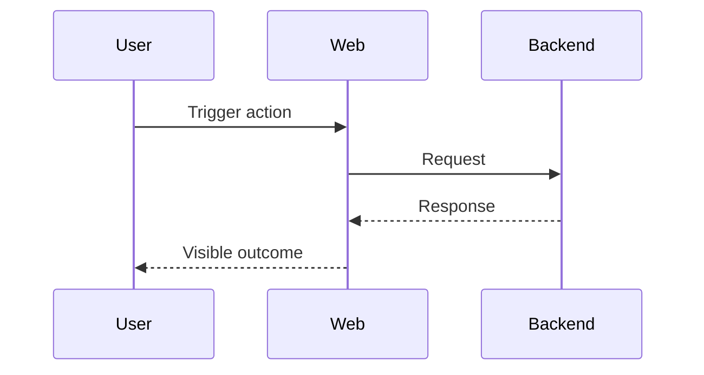

<!--
Issue grooming template (bug)
Fill in placeholders and delete sections that are not applicable.

Issue: {{ISSUE_URL}}
Title: {{TITLE}}
Groomed: {{DATE}}
-->

## Overview
[1-3 sentences: what is broken + user impact]

## Repro
- Environment: [prod/staging/local], [browser], [account/state], [feature flag]
- Steps:
  1. [Step 1]
  2. [Step 2]
  3. [Step 3]
- Expected:
- Actual:

## Root Cause
[What broke + where. Include file paths and the specific bad assumption/logic.]

## Dependencies
- Blocked by: #N - [reason]
- Blocks: #M - [reason]
- Related: #X - [context]

## Files Involved
- `path/to/file.ts` - [changes needed]

## Fix Strategy
1. [Tighten/adjust logic with explicit edge cases]
2. [Add/update tests to prevent regression]
3. [Add logs/metrics/guards if needed]

## Mermaid Diagram
<!-- Required when 2+ systems or non-trivial data flows are involved -->

## Acceptance Criteria
- [ ] **AC1: Bug fixed**
  - Given: [starting state]
  - When: [action]
  - Then: [expected outcome]
  - **Test**: convex | stagehand | stagehand+visual | venom | manual (checklist) | no test (reason)

- [ ] **AC2: Regression prevented**
  - Given:
  - When:
  - Then:
  - **Test**:

## Test Scenarios
- [ ] Scenario 1: [short name]
  - Setup:
  - Action:
  - Expected:
  - **Test**:

## Prevention

| Failure Mode | Prevention |
| --- | --- |
| [What broke] | [linter/test/type check/monitoring/guardrail] |

## Checklist
- [ ] Repro steps are complete and deterministic
- [ ] Root cause points to a concrete location in code
- [ ] Fix includes a regression test (or a justified manual checklist)
- [ ] Mermaid renders on GitHub (if present)
