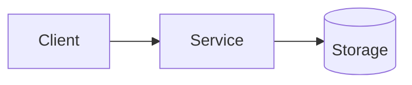

<!--
Issue grooming template (feature/chore)
Fill in placeholders and delete sections that are not applicable.

Issue: {{ISSUE_URL}}
Title: {{TITLE}}
Groomed: {{DATE}}
-->

## Overview
[1-3 sentences: problem/feature + why it matters]

## Context
- Current behavior:
- Expected behavior:
- Users/impact:
- Notes/constraints:

## Non-Goals
- [ ]

## Dependencies
- Blocked by: #N - [reason]
- Blocks: #M - [reason]
- Related: #X - [context]

## Files Involved
- `path/to/file.ts` - [changes needed]

## Implementation Strategy
1. [Step 1]
2. [Step 2]
3. [Step 3]

## Mermaid Diagram
<!-- Required when 2+ systems or non-trivial data flows are involved -->

## Acceptance Criteria
- [ ] **AC1: [name]**
  - Given: [precondition]
  - When: [action]
  - Then: [outcome]
  - **Test**: convex | stagehand | stagehand+visual | venom | manual (checklist) | no test (reason)

- [ ] **AC2: [name]**
  - Given:
  - When:
  - Then:
  - **Test**:

## Test Scenarios
- [ ] Scenario 1: [short name]
  - Setup:
  - Action:
  - Expected:
  - **Test**: convex | stagehand | stagehand+visual | venom | manual (checklist) | no test (reason)

- [ ] Scenario 2: [short name]
  - Setup:
  - Action:
  - Expected:
  - **Test**:

## Test Artifacts
- [ ] Results in issue comment or CI artifacts
- [ ] Logs/screenshots attached where relevant
- [ ] Preview deploy clean (if applicable)
- [ ] GitHub Actions pass

## Checklist
- [ ] Scope and non-goals are explicit
- [ ] Dependencies linked
- [ ] Mermaid renders on GitHub (if present)
- [ ] Each AC has a test type
