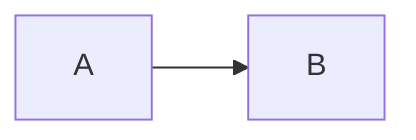

# GitHub Mermaid Compatibility

GitHub renders Mermaid diagrams in Markdown when you use a fenced code block with `mermaid`:

````markdown

````

## Validate the Mermaid Version GitHub Uses

GitHub’s Mermaid version can change over time. If you are using any non-trivial Mermaid features, confirm the version by pasting this into an issue comment (or a scratch issue):

````markdown
```mermaid
info
```
````

Then stick to syntax supported by that version.

## Common Rendering Failures (and Fixes)

- Diagram does not render at all:
  - Ensure the code fence language is exactly `mermaid`.
  - Ensure the code fence is not indented under a list item (some Markdown renderers get picky). Prefer a blank line before the fence.
  - Remove Mermaid init directives (`%%{init: ...}%%`) and theme config first; add back only if needed.
- “Parse error” on GitHub but works elsewhere:
  - Simplify labels. Put complex text in quoted labels, not in node IDs.
  - Keep node IDs simple: `A`, `B`, `auth_service`. Put human labels in brackets/quotes: `A["Auth service (WorkOS)"]`.
  - Avoid HTML in labels.
- Weird edges/layout:
  - Prefer `flowchart LR` / `flowchart TD` and keep graphs small.
  - Avoid excessively long labels; wrap by rephrasing instead of adding line breaks.

## Recommended Diagram Subset (Stable on GitHub)

Prefer these diagram types unless you have confirmed a newer Mermaid version and tested rendering:

- `flowchart` (systems + data flow)
- `sequenceDiagram` (request/response + async flows)
- `stateDiagram-v2` (state machines)
- `classDiagram` (types and relationships)
- `erDiagram` (DB schema relationships)

## Local Validation (Catch Syntax Errors Early)

If you can run Node tooling locally, render diagrams via Mermaid CLI. This catches many syntax errors before you paste into GitHub:

```bash
# Render a single Mermaid file:
npx -y @mermaid-js/mermaid-cli -i diagram.mmd -o diagram.svg
```

If your Mermaid is embedded in a Markdown file, use this skill’s helper script:

```bash
node scripts/validate_mermaid_in_md.mjs path/to/issue-body.md
```

This extracts all Mermaid blocks and tries to render them. If `npx` is unavailable, the script prints fallback instructions.

## Authoring Tips

- Label edges with verbs: `Web -->|fetchInvoices| Backend`
- Prefer one diagram per issue. If you need more, keep each diagram tight and purpose-specific.
- Put any “why” in the text sections, not inside the diagram.
